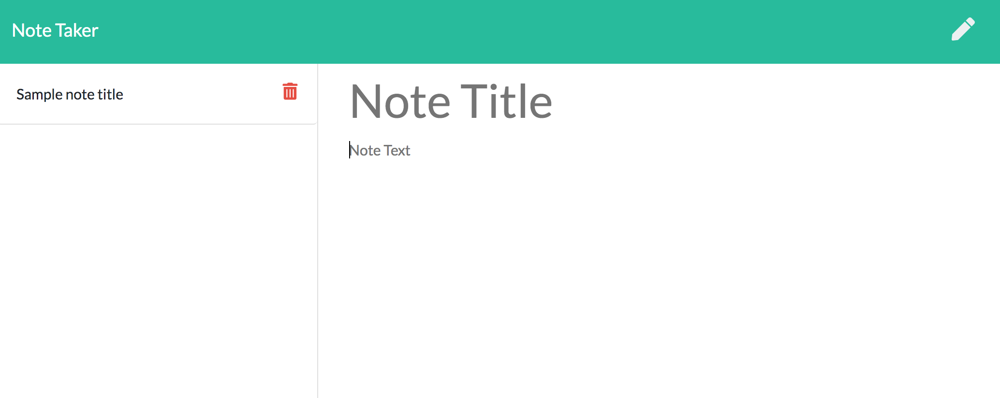

# note-taker

## Description
A deployed note taking app that allows a user to write and save notes. They can be accessed from any device as the notes are stored on a server and not in local storage. 

## Built With
* JavaScript
* Node
* ES6
* CSS
* HTML
* express

## Link to deployed site
[Click here](http://obscure-bastion-66044.herokuapp.com/)

## Screenshot

## Contribution
Made by Emily Kidd 

## Contact
[GitHub](github.com/emilykidd3)  
[Email](mailto:e.kidd61@yahoo.com)